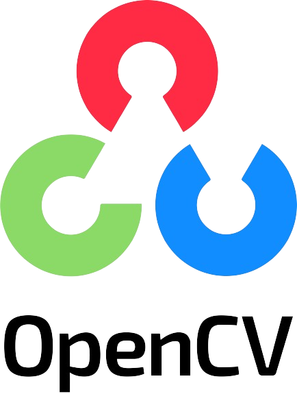

# Sign Language Detection Model (handspeak.ai)

This project implements a real-time object detection system using PyTorch and YOLOv5 to identify hand gestures in video streams. It's designed for <b>HandSpeak.ai</b>, a potential communication tool for sign language interpretation.

### Features
* Leverages PyTorch and YOLOv5 for efficient object detection.
* Captures video from your webcam.
* Detects objects at a frequency of 0.5 seconds or when no objects are currently detected (improves responsiveness).
* Displays bounding boxes and labels for detected objects with confidence scores.
* Highlights the most recently detected object in a dedicated area on the frame.

### Requirements
* Python 3.11
* PyTorch
* Roboflow
* OpenCV
* NVIDIA CUDA (For faster processing)
* YOLOv5 (https://github.com/ultralytics/yolov5)
* Dataset Link(Download YoloV5 PyTorch version) : https://public.roboflow.com/object-detection/american-sign-language-letters/1

### Collaborators

| Name | Github Account |
|:-----|:---------------|
| Aditya Singh | [@ascoder1109](https://github.com/ascoder1109) |
| Dhiraj Agarwal | [@DhirajAgarwa](https://github.com/DhirajAgarwa) |
| Karmanya Thapa | [@Karmanya20](https://github.com/Karmanya20/) |

### Tech Stack

